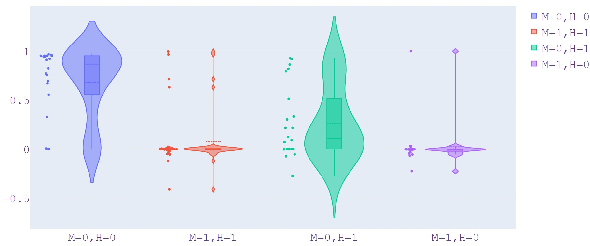

# Comparing human-intuition of semantically similar code against machine interpretation

This repo contains all the data, code, results, and analysis documents we create as part of our study on evaluating the trustworthiness of the CodeBERT code model's semantic clone detection capablities. This repo is companion to our paper submission. 

The idea is to manually annotate the statements and tokens that a human perceives as being the causes of similarity or dissimilarity, perform mutations using the annotations, and then analyze the model's reaction to the changes. 

## Folder Structure
The Code/ folder contains all code needed to run the experiments on the Java and Python clone pairs. <br/>
The Data/ folder, contains all original clone pairs in Java and Python, the clone pairs with statement-level annotations, and the clone pairs with token-level annotations. <br/>
The Result/ folder contains two csv files generated as part of our experiments and contain the model predictions for all our muttaion configurations. 

## How to run experiments

First, you need to install all required packages,

```
pip install transformers==4.0.1
pip install torch===1.7.0
pip install numpy===1.19.2
pip install -U scikit-learn
pip install seaborn===0.11.0
pip install pandas===1.1.3
pip install tqdm===4.50.2
```
The mymodel.bin file is not on GitHub because of the large file size. Please download from this link https://doi.org/10.5281/zenodo.7473110 and place it in the Code/Java and Code/Python folders. Copy the data in Data/ folder into corresponding folder in Code/. (e.g. move the three folders in Data/Python folder to the Code/Python folder). Then, execute the following two Python scripts.

```
cd Code/Python
python Statement&Token.py
cd Code/Java
python Statement&Token.py
```
Two files; python_result.csv and java_result.csv will be generated.

## Analyzing results of experiments

The Analysis/ folder contains the analysis workbooks for both Java and Python. From our analysis, we derive two csv files for plotting the prediction score sensitivities of both Java and Python clone pairs to mutations. These two files are used as input in the violinplot.py script to obtain violin plots for the prediction score sensitivities. 

```
cd Analyis
python violinplot.py
```

By executing the above commands, you will get the following plots:



